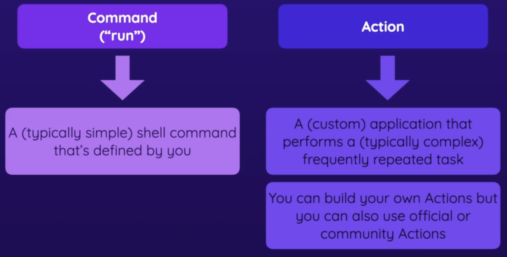

# GitHub Actions - Basic Building Blocks and Components

1. Understanding the Key Elements 
1. Working with Workflows, Jobs & Steps 
1. Building an Example Workflow

## Key Components: Workflows, Jobs, Steps & More

<p align="center"></p>

## Running a simple workflow

Here is a simple workflow - 

```yaml
name: First Workflow
on: workflow_dispatch
jobs:
  first-job:
    runs-on: ubuntu-latest
    steps:
      - name: Print greeting
        run: echo "Hello, World!"
      - name: Print goodbye
        run: echo "Goodbye, world!"
```

:warning: The `workflow_dispatch` event will allow us to run the workflow manually when we want to.

## Running workflow for projects

GitHub Actions run on containers hosted elsewhere. This means that every sample project will have to be fetched inside a workflow step. This step can be done with a help of an Action.

<p align="center"></p>

To fetch the code a project, the `checkout` GitHub Action can be used.

:warning: Do check the GitHub Actions [runners page](https://docs.github.com/en/actions/using-github-hosted-runners/about-github-hosted-runners) to know about the software that comes pre-installed with each runner.

