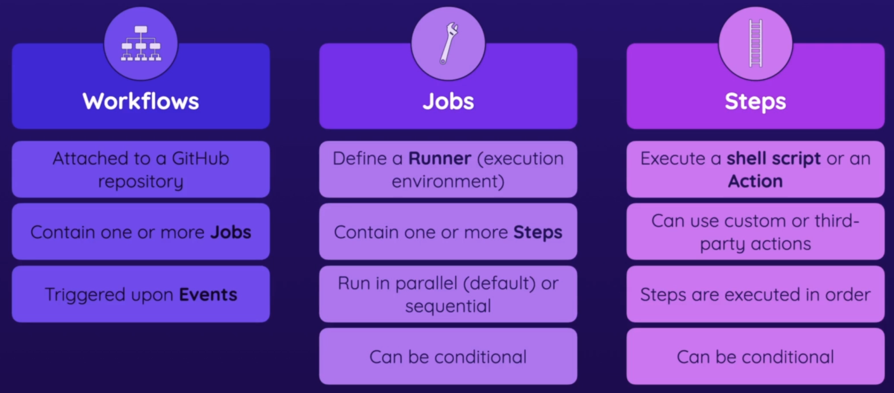

# GitHub Actions - Basic Building Blocks and Components

1. Understanding the Key Elements 
1. Working with Workflows, Jobs & Steps 
1. Building an Example Workflow

## Key Components: Workflows, Jobs, Steps & More

