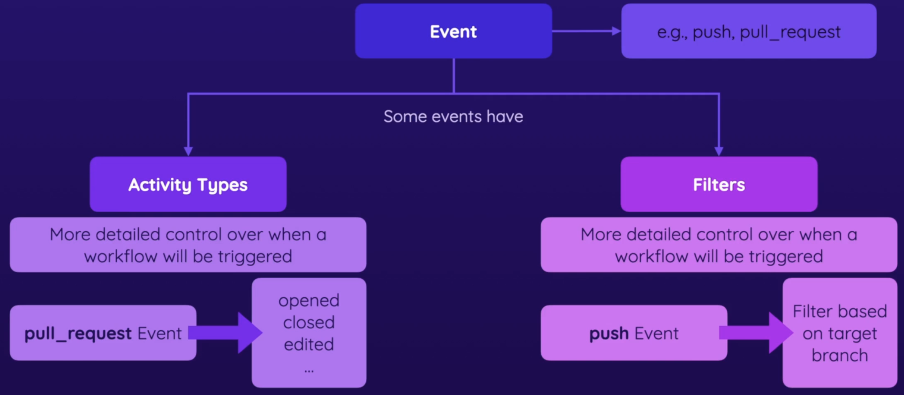
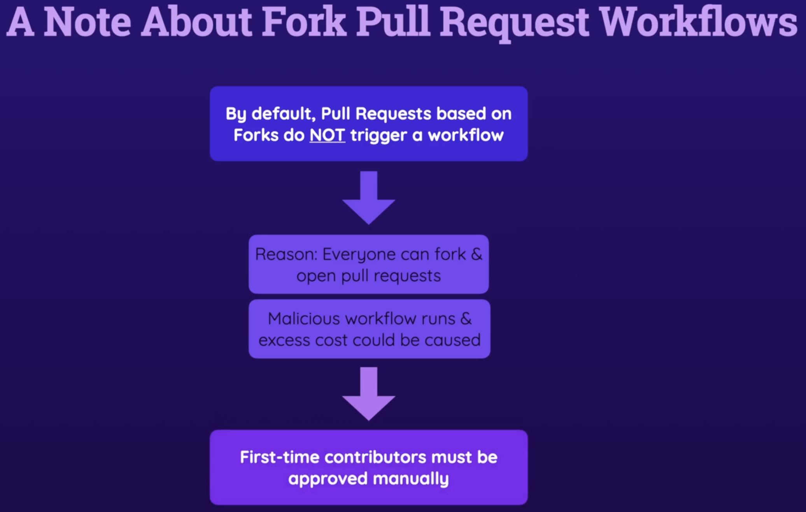
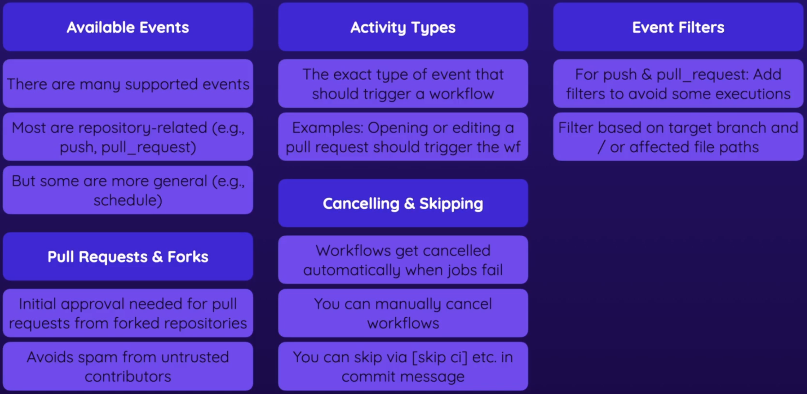

# Workflows & Events: Deep Dive

## Event Activity Types & Filters

<p align="center"></p>

Each GitHub Action event can have activities or filters based on its type. Activities and filters allow us to configure a GitHub Action event in more detail.

If you decide to use types and filters, you'll have to expand each types like so -

```yaml
on:
  pull_request:
    types: 
      - opened
  workflow_dispatch:
  push:
    paths:
        - "**.js"
```

:warning: For a detailed example, you can have a look at `section-02-types-filters.yaml` workflow.

GitHub actions allows you to push a workflow based on many filters like - `paths`, `path-ignore`, `branches`, `branches-ignore` etc.

## PR and Forks

<p align="center"></p>

## Skipping workflow runs

In certain cases, we may want to skip GitHub Actions from running our workflow, this can be done by adding an additional pharse in the commit message - `[skip ci]`

Here is an example - 

`chore: update comments [skip ci]`

More information can be found [here](https://docs.github.com/en/actions/managing-workflow-runs/skipping-workflow-runs).

## Summary

<p align="center"></p>
