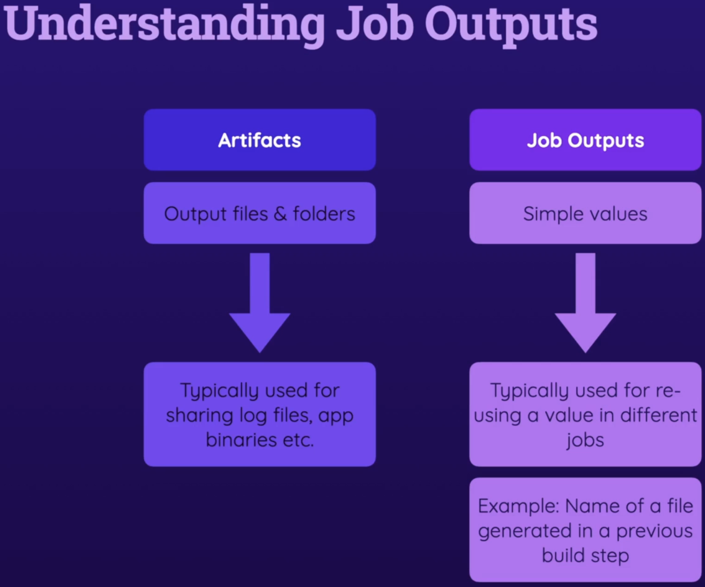
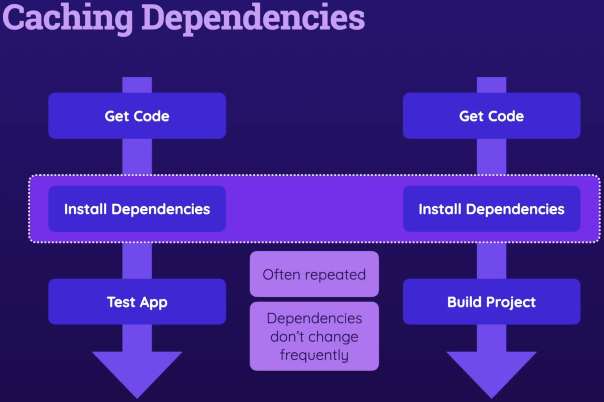

# Job Artifacts and Outputs

## Understanding Artifacts

<p align="center"></p>

### Uploading Artifacts

To upload certain output files as artifacts, we make use of a GitHub action called [upload-artifact](https://github.com/actions/upload-artifact)

The relative paths for artifacts are rooted against the current working directory.

:warning: Changing the current working directory at the job level will not be affect `upload-artifact` action. For `upload-artifact@v4` action, the **current working directory will always be the root of the current project**.

### Downloading Artifacts

To download artifacts, the `download-artifact` GitHub Action can be used. 

:warning: This action will unpack all the contents of the zipped artifact in the current working directory of a job.

For a complete example, have a look at [section-03-demo.yaml](../.github/workflows/section-03-demo.yml) file.

## Understanding Job Outputs

<p align="center"></p>

:warning: Outputs are Unicode strings, and can be a maximum of 1 MB. The total of all outputs in a workflow run can be a maximum of 50 MB.

More information can be found [here](https://docs.github.com/en/actions/using-jobs/defining-outputs-for-jobs)

Each output is a key-value pair and the key has to be specified in `job.job-id.outputs`. 

Here is an example - 

```yaml
  build:
    runs-on: ubuntu-latest
    outputs:
      publish-script-file: ${{ steps.publish-filename.outputs.script-file }}
    defaults:
      run:
        working-directory: ./Section-03/sample-project
    steps:
      - name: Get code
        uses: actions/checkout@v3
      - name: Install dependencies
        run: npm ci
      - name: Build website
        run: npm run build
      - name: Publish JS filename
        id: publish-filename
        run: find dist/assets/*.js -type f -execdir echo 'script-file={}' >> '$GITHUB_OUTPUT' ;'
  deploy:
    needs: build
    runs-on: ubuntu-latest
    steps:
      - name: Echo published script-file
        run: echo "${{ needs.build.outputs.publish-script-file }}"
```

:warning: While referencing the output of another job, please use the `needs` object and NOT the `jobs` object.

## Dependency Caching

<p align="center"></p>

GitHub Actions allows us to cache dependencies so that they are not downloaded over and over again in subsequent jobs. Caching can also be applied to other files and folders that are downloaded/created over and over again.

The `actions/cache` [GitHub Action](https://github.com/actions/cache) can be used to cache items.

The dependencies are cached in a central location and will be made available to subsequent workflows/jobs.

:warning: `action/cache` has to be used in the step before where caching is required.
