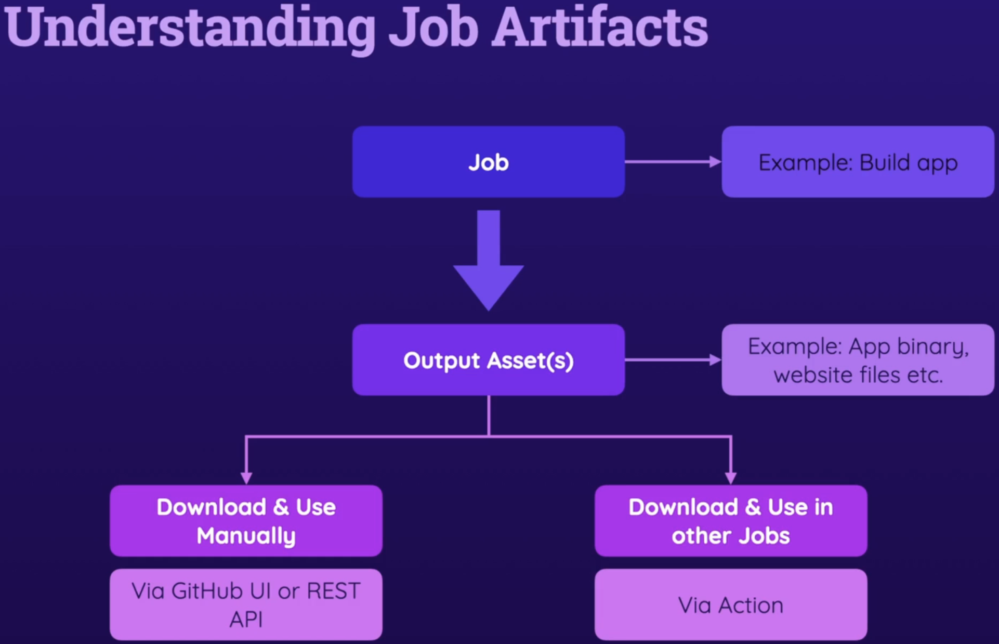

# Job Artifacts and Outputs

## Understanding Artifacts

To push certain output files as artifacts, we make use of a GitHub action called [upload-artifact](https://github.com/actions/upload-artifact)

The relative paths for artifacts are rooted against the current working directory.
