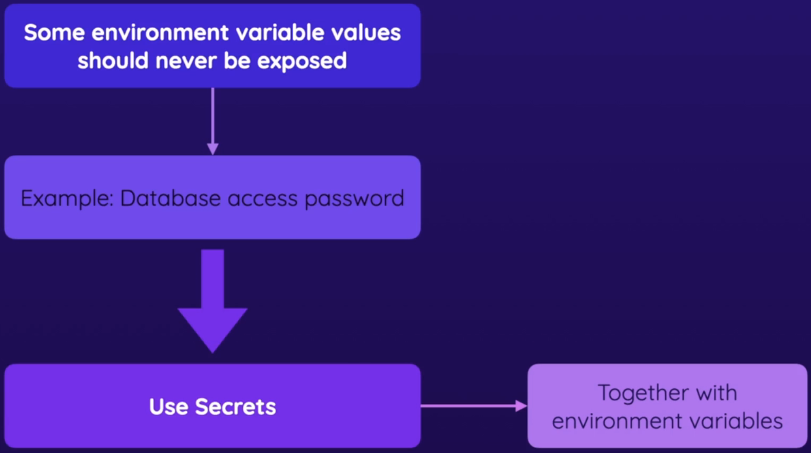
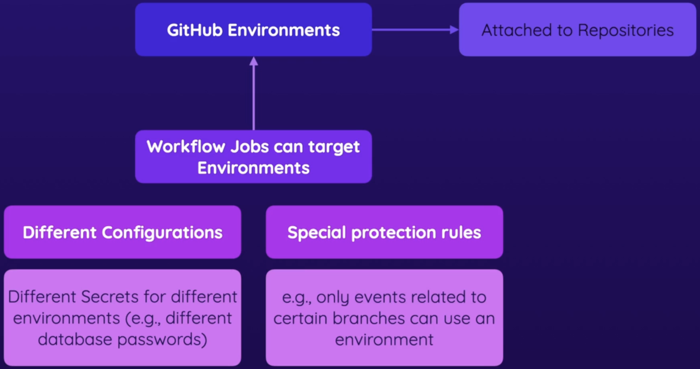
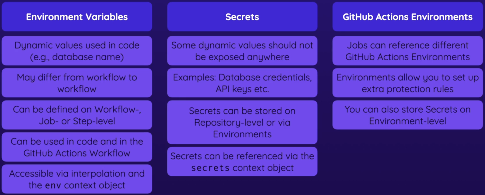

# Using Environment variables and Secrets

## Introduction to Environment variables

Environment variables can be defined at the workflow level, job level or step level. The `env` context can be used to define environment variables. 

Here is an example -

```yaml
name: Deployment
on:
  push:
    branches:
      - main
      - dev
env:
  key1: value1
  key2: value2

jobs:
  newJob:
    env:
      key1: value1
      key2: value2
    runs-on: ubuntu-latest
    steps:
      - ...
```
:warning: Job level envs cannot be visible outside of the job in which the envs are defined.

> GitHub Actions also provides a couple of default environment variables that are set automatically: https://docs.github.com/en/actions/learn-github-actions/environment-variables#default-environment-variables

> These environment variable can, for example, give you quick access to the repository to which the workflow belongs, the name of the event that triggered the workflow and many other things.

## Environment variables vs Secrets

<p align="center"></p>

Secrets can be stored at organisation level or repository level

Repository secrets can be referred in a workflow by using the `secrets` context.

## Using Repository Environments

> Environments are used to describe a general deployment target like production, staging, or development. 

> When a workflow job references an environment, the job won't start until all of the environment's protection rules pass. A job also cannot access secrets that are defined in an environment until all the deployment protection rules pass.

<p align="center"></p>

The `environment` keyword can be used to add an environment defined in the GitHub repository.

:warning: Environment has to be defined for each job.

## Summary

<p align="center"></p>
